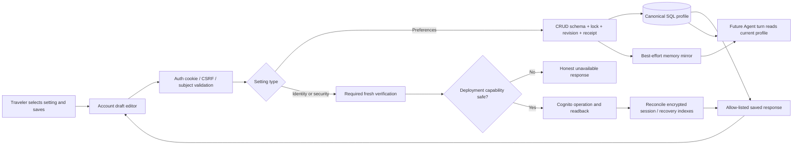

# Phase 13: Account settings and travel preferences — Research

**Researched:** 2026-10-06
**Domain:** Cognito account management, transactional traveler preferences, selected C account UI
**Confidence:** MEDIUM overall; source inspection and executed tests establish local behavior, while real credential mutations are deliberately untested.

<user_constraints>
## User Constraints (from CONTEXT.md)

Verbatim source excerpt (all subsections retained). [VERIFIED: .planning/phases/13-account-settings-and-travel-preferences/13-CONTEXT.md:3-30]

<!-- DATA_6b31afc9_START -->

## Locked user decisions
User requested the complete GSD workflow to generate the real account page after choosing prototype C (“c would be perfect”). Continue through planning, implementation and verification. The discussion and prototype selection have already happened; do not ask again.

- Use C: settings list with adjacent inline editor; grouped selector on mobile.
- Support light and dark mode across this account interface, with an explicit theme control.
- Personal details: first name, last name, email (verified changes).
- Travel preferences: all existing onboarding answers — home location/city, optional airport, multiple citizenships, dietary/food needs, accessibility needs, curated and custom interests.
- Optional fields can be removed; no five-interest minimum for editing an existing profile.
- Security: password change, authenticator management and recovery codes using real existing identity service contracts, extended where necessary.
- Explicit Save/Cancel per setting; protect unsaved edits, show real errors and retain ordinary drafts after failures. No successful UI before acknowledged saved state.
- Updated profile informs future suggestions; existing confirmed Plan details are never silently changed.
- Account deletion and sign-out-all-devices are outside the agreed page scope.

## Design source
Branch `prototype/account-settings`, selected variant C in `frontend/src/prototypes/AccountSettingsPrototype.jsx`. Screenshot source: `artifacts/testing/2026-10-05-account-prototypes/plan/c-light.png`, `c-dark.png`, and mobile equivalents. Keep prototype source on its throwaway branch; build a proper production feature instead of shipping stubs or all variants.

## Implementation discretion
Reuse project auth/cookie boundary, CRUD ownership, revision/idempotency and memory projection. Prefer account edits that keep onboarding completion and unrelated profile fields unchanged. Reuse canonical catalogs and place controls. Exact API decomposition, safe identity-verification steps, tests and small accessibility/responsive adjustments are implementation choices. No cloud provisioning/configuration changes or actual credential/email/MFA mutations on the shared example account just for testing.

## Delivery gates
Follow docs/skills/travella-testing/SKILL.md: real HTTP CRUD integration with test DB, Chrome DevTools authenticated journey using the example account, screenshots and sanitized evidence, read-back/reload, ownership and failure checks. Read .agents/skills/travella-local/SKILL.md before local rebuild. Record exact external blockers without overstating completion. Existing earlier-phase verification debt must not be relabeled complete.

<!-- DATA_6b31afc9_END -->
</user_constraints>

## Summary

Build the account feature on the existing cookie boundary and CRUD profile repository. The auth service already keeps provider tokens server-side and independently validates the provider account; the profile repository already serializes writes per traveler and maintains replay receipts. Extend those seams instead of coupling identity data to the traveler-preference document. [VERIFIED: services/auth/api.py:256-294; services/crud/profile.py:22-110]

The live local pool explicitly returned `"AttributesRequireVerificationBeforeUpdate": []` during read-only inspection. This is a real blocker for safe email initiation: Cognito requires the email entry in that setting to defer changing the canonical address until verification. Implement the full safe flow and its tests, but advertise an unavailable capability and refuse initiation under the present configuration. Do not change AWS configuration. [VERIFIED: AWS DescribeUserPool read-only probe 2026-10-06] [CITED: https://docs.aws.amazon.com/cognito-user-identity-pools/latest/APIReference/API_UserAttributeUpdateSettingsType.html]

**Primary recommendation:** Deliver profile sections and signed-in account/security management as separate contracts. Treat live email activation and existing signed-out recovery assurance as explicit external limitations, not successful verification.

## Architectural Responsibility Map

This is the implementation responsibility recommendation, grounded in existing service boundaries. [VERIFIED: services/auth/api.py:296-359; services/crud/api.py:236-259; services/agent/service.py:84-111]

| Capability | Primary Tier | Secondary Tier | Rationale |
|---|---|---|---|
| Setting selection, drafts, theme, route/back behavior | Browser | — | Presentation state; no identity authority |
| Canonical names/email and MFA status | Auth backend + Cognito | Browser | GetUser allow-listed projection; provider owns attributes |
| Sensitive mutation verification | Auth backend + Cognito | Encrypted session store | Bind to authenticated subject and current browser session |
| Preference section writes | CRUD backend | SQL store | Lock, revision, replay receipt, canonical readback |
| Future suggestions | Agent backend | Advisory memory | Read current CRUD profile; explicit clears override stale mirror |
| Existing Plan details | CRUD backend | Browser confirmation | Account writes must not mutate Plan records |

<phase_requirements>
## Phase Requirements

Requirement descriptions below are verbatim from REQUIREMENTS. [VERIFIED: .planning/REQUIREMENTS.md:240-245]

| ID | Description | Research Support |
|---|---|---|
| ACCOUNT-13-01 | Selected C authenticated account route, desktop inline editor/mobile setting selector, return navigation, light/dark appearance. | Routing and selected-C reuse below |
| ACCOUNT-13-02 | Read/update all onboarding preference sections with explicit save/cancel, optional clearing, no interest minimum, revision and idempotency protection, no onboarding reset. | Separate account mutation and shared validation |
| ACCOUNT-13-03 | Canonical name editing and verified email-change flow; no private identity derived from browser-supplied user IDs. | GetUser/UpdateUserAttributes and before-update gate |
| ACCOUNT-13-04 | Password change and authenticator/recovery-code management with required verification and honest state, keeping secrets out of projections/logs/URLs. | Step-up, MFA preference/readback, encrypted recovery state |
| ACCOUNT-13-05 | Saved/cleared preferences reach future agent suggestions through canonical profile/memory contracts without mutating Plans. | Canonical profile projection already preserves clears |
| ACCOUNT-13-06 | API persistence/ownership/failure tests plus example-account Chrome desktop/mobile/theme verification and screenshots. | Baseline results and validation map |
</phase_requirements>

## Project Constraints (from AGENTS.md)

The following directives are binding project constraints. [VERIFIED: AGENTS.md, read in full 2026-10-06]

- Read and follow the mandatory Travella testing skill before work and completion; honor the prototype choice already made.
- Enter edits through the GSD workflow. This research is delegated by the active plan-phase workflow; no production changes or commits are authorized for this research task.
- Require explicit traveler action and exact confirmation for durable Plan changes; one destination per Plan, return flights and same-location car returns.
- CRUD owns durable Plan data; Agent and Connector must honor authorization and revisions.
- Public services validate managed-identity tokens independently and derive traveler identity from tokens.
- Keep credentials, tokens, codes, personal data, raw payloads and internal reasoning out of logs, URLs, checkpoint/browser projections; the account detail response is a deliberately narrow private identity surface.
- Keep provider status honest, writes/events idempotent, saved snapshots complete, and interrupted research obsolete.
- Preserve seven-day Draft recovery followed by permanent identifiable-data removal.
- Preserve independent frontend, Agent, CRUD and private Connector deployables; retain Cognito, AG-UI, LangGraph and AWS foundations.
- Apply existing local startup skill before a rebuild; no volume deletion.
- Account changes require HTTP handler + database persistence coverage and real Chrome DevTools evidence, not only mocks/builds. Do not mutate the shared example account's credentials, email or MFA for testing. [VERIFIED: docs/skills/travella-testing/SKILL.md, read in full; .planning/phases/13-account-settings-and-travel-preferences/13-CONTEXT.md, quoted above]

## Standard Stack

Reuse the installed, locked stack. No dependency upgrade or new package is needed by this design; therefore no package installation/legitimacy audit is proposed. These are existing manifest/lock values, not claims of latest registry releases.

| Library | Existing version / declaration (verbatim) | Use / evidence |
|---|---|---|
| React | `"react": "^19.1.0"` | Account component and hooks. [VERIFIED: frontend/package.json:11-18] |
| Vite / Vitest | `"vite": "^7.1.0"`, `"vitest": "^4.1.11"` | Existing build/test commands. [VERIFIED: frontend/package.json:20-27] |
| boto3 | `name = "boto3"`, `version = "1.43.103"` | Existing provider adapter; lock upload date 2026-09-25. [VERIFIED: uv.lock:64-74] |
| FastAPI | `name = "fastapi"`, `version = "0.141.1"` | Auth and CRUD boundaries; lock upload date 2026-07-29. [VERIFIED: uv.lock:437-449] |
| Pydantic | `name = "pydantic"`, `version = "2.13.5"` | Strict account and section contracts; lock upload date 2026-08-28. [VERIFIED: uv.lock:1132-1141] |
| SQLAlchemy | `name = "sqlalchemy"`, `version = "2.0.54"` | Existing repository/store transactions; lock upload date 2026-09-15. [VERIFIED: uv.lock:1562-1569] |
| pytest | `name = "pytest"`, `version = "9.1.1"` | HTTP integration and adapter/store tests. [VERIFIED: uv.lock:1259-1269] |

Installed Python package versions were also checked with importlib.metadata and matched the rows above. [VERIFIED: local runtime probe 2026-10-06]

## Architecture Patterns

### System Architecture Diagram

Recommended data flow:



### Profile section writes

Use a distinct account section mutation, sharing validators without onboarding progress transitions. Existing schema values are `step: Literal["home", "citizenship", "needs", "interests"]`, `action: Literal["continue", "skip"]`, `expected_revision: int = Field(ge=0, strict=True)`, `event_id: UUID`. Account edits should reuse the four section concepts and revision/event concepts, but must not send onboarding actions. [VERIFIED: services/crud/profile_schemas.py:176-190]

Separate reusable interest normalization/bounds from onboarding completion policy. Existing `if len(seen) < 5:` raises `"Choose at least five interests, or skip this step."`; retain this for onboarding, omit it in account edit validation. Empty citizenship lists, empty needs strings, empty interest arrays, and a null airport are deliberate removals; home city remains required. Existing home source union is `source: Literal["manual", "google"]`. [VERIFIED: services/crud/profile_schemas.py:47-55,104-167]

For each save: acquire traveler lock; validate section; check receipt before current revision; reject reused identifier with changed body; reject stale revision; merge only section fields; derive compatibility fields; preserve completion/progress and unrelated values; increment revision once; store receipt and data atomically; return ProfileOutput. Existing error codes are `"invalid_profile"`, `"revision_conflict"`, and `"request_reused"`. Existing receipt retention is `if len(receipts) > 64:` ordered by response revision. [VERIFIED: services/crud/profile.py:52-110; services/crud/contracts.py:59-64]

Add the new section route to both auth proxy registration and CrudClient's explicit route/method allow-list. Current API route literals are `"/v1/traveler-profile"` and `"/v1/traveler-profile/onboarding"`; the latter currently permits only `{"PATCH"}`. [VERIFIED: services/auth/api.py:322-359; services/auth/crud_client.py:49-53]

### Canonical names and safe verified email

Read account display state from GetUser, not registration form state or email entered on sign-in. Existing registration writes attributes `{"Name": "given_name", "Value": first_name}`, `{"Name": "family_name", "Value": last_name}`, `{"Name": "email", "Value": email}`. Update names together with UpdateUserAttributes, then GetUser readback. [VERIFIED: services/auth/cognito_adapter.py:12-35] [CITED: https://docs.aws.amazon.com/cognito-user-identity-pools/latest/APIReference/API_UpdateUserAttributes.html]

Safe email sequence: fresh account-bound verification → validate deployment capability → UpdateUserAttributes(new email) → private pending state → VerifyUserAttribute(code) → GetUser confirms exact new verified address → reconcile local sessions/recovery lookup. Resend uses GetUserAttributeVerificationCode. Never use signup confirmation or administratively set email_verified. Keep old address visible as current until acknowledged verification. Serialize competing pending changes and reject obsolete confirmations. [CITED: https://docs.aws.amazon.com/cognito-user-identity-pools/latest/APIReference/API_VerifyUserAttribute.html] [CITED: https://docs.aws.amazon.com/cognito-user-identity-pools/latest/APIReference/API_GetUserAttributeVerificationCode.html]

Treat cancellation after sending an email as leaving the local editor, not proof that Cognito revoked the sent code. Do not promise revocation without a supported provider operation. Preserve/reconcile pending intent server-side across reload; bind it to subject and initiating authenticated session. These are implementation recommendations.

Local pool inspection returned `"AttributesRequireVerificationBeforeUpdate": []`, `"AutoVerifiedAttributes": ["email"]`, `"UsernameAttributes": ["email"]`, `"MfaConfiguration": "OPTIONAL"`, `"SoftwareTokenMfaConfiguration": {"Enabled": true}`. Before-update verification is therefore not active for email. ReadAttributes/WriteAttributes were not returned; AWS explicitly documents this response behavior for default permissions, so it is not evidence of denied access. [VERIFIED: sanitized AWS read-only probe 2026-10-06] [CITED: https://docs.aws.amazon.com/cognito/latest/developerguide/user-pool-settings-attributes.html]

Implement an injected capability/configuration reader, fail closed on unknown/unsafe pool state, and return a safe unavailable reason. Runtime DescribeUserPool inspection itself needs IAM; when unavailable, use an explicit deployment attestation defaulting off, never infer safety from a successful UpdateUserAttributes call. No resource changes are part of this phase. Capability failures must not block reading names/preferences.

### Sessions, email indexing and reauthentication

Current identity gate checks `attributes.get("sub") != subject.subject or attributes.get("email_verified") != "true"`. Current sign-in stores the submitted `"email": email`, while recovery uses `WHERE email = :email` and reset invalidation matches `value.get("email") == email`. A verified email change must update both stored recovery email copies and all relevant session email copies by stable subject; otherwise recovery/reset can use the obsolete address. Also populate future sessions from canonical GetUser email. [VERIFIED: services/auth/api.py:256-279; services/auth/session_store.py:174-183,215-269]

Bound phase changes to helper methods in the current encrypted store; no broad identity rewrite is required. Add an account subject lock for concurrent sensitive operations and make local reconciliation retryable: a provider success cannot be rolled back by a local SQL rollback. On ambiguous completion, perform GetUser readback and reconcile before presenting a result. Keep original session expiry ceiling. [VERIFIED: services/auth/session_store.py:119-130; services/auth/api.py:637-656]

Recommended step-up: require current password for email initiation and security management; when Cognito returns its existing TOTP challenge, complete it with the current factor before accepting verification. Derive username from canonical provider account, validate the resulting token subject against the existing session, and revoke/discard temporary refresh tokens. Do not reuse public sign-in handler: it deletes/replaces the current browser session. Use a short-lived, session-bound proof for multistep enrollment; invalidate it after mutation and on expiry. This is a security implementation choice under CONTEXT discretion, not a claim that Cognito automatically provides application step-up.

### Password, authenticator and recovery-code management

ChangePassword takes access token, PreviousPassword, and ProposedPassword for password users. Do not reuse forgot/reset flow for an authenticated change. Local policy inspected: minimum eight characters plus upper/lower/numeric/symbol requirements; display these current requirements or a server-safe policy projection, and let Cognito enforce policy/history. [CITED: https://docs.aws.amazon.com/cognito-user-identity-pools/latest/APIReference/API_ChangePassword.html] [VERIFIED: sanitized AWS DescribeUserPool probe 2026-10-06]

For signed-in enrollment/replacement, use AssociateSoftwareToken and VerifySoftwareToken with the existing access token, then SetUserMFAPreference and GetUser readback. The current handler unnecessarily requires `result.get("Session")` despite subsequently verifying by access token, and returns recovery codes without a preference-setting call. Correct this seam; do not claim active MFA based only on local enrollment success. AWS distinguishes factor verification from preference activation; replacement invalidates the old factor when the new one is verified. [VERIFIED: services/auth/api.py:467-507] [CITED: https://docs.aws.amazon.com/cognito-user-identity-pools/latest/APIReference/API_AssociateSoftwareToken.html] [CITED: https://docs.aws.amazon.com/cognito-user-identity-pools/latest/APIReference/API_SetUserMFAPreference.html]

Disable through SetUserMFAPreference after fresh verification and canonical readback; describe it as disabling, not deleting the registered secret. If pool policy forbids disabling, return honest unavailable state. Recovery-code rotation is an application operation: generate a fresh set, atomically replace hashes for the authenticated subject, disclose once in a dedicated response, and return only count/status on ordinary reads. Never put plaintext codes or enrollment secrets into localStorage, persisted drafts, ordinary account projections or screenshots. Current generator is `secrets.token_hex(4).upper()` repeated `range(10)`; use stronger entropy for newly rotated codes while accepting existing legacy codes according to existing validation. [VERIFIED: services/auth/api.py:503-507; services/auth/session_store.py:215-269] [CITED: https://docs.aws.amazon.com/cognito-user-identity-pools/latest/APIReference/API_SetUserMFAPreference.html]

Recovery rotation retries require particular care: never automatically issue another set after an unknown network result. Reconcile status and offer an explicit regenerate action if the one-time disclosure was lost; do not silently re-display stored plaintext. This is the recommended bounded implementation.

**Prior-phase recovery debt:** The signed-out recovery flow consumes an app code then attempts AssociateSoftwareToken using a `"SOFTWARE_TOKEN_MFA"` challenge, and answers that original challenge after replacement. Current mocks expect that sequence, so passing them proves application behavior, not Cognito support. AWS describes the VerifySoftwareToken response session as satisfying MFA_SETUP; current documentation also provides IAM-authorized AdminDeleteSoftwareToken for lost factors. Keep signed-in enrollment/disable/rotate work separate. Do not introduce administrative bypass, IAM provisioning or claim this older recovery flow is live-verified. [VERIFIED: services/auth/api.py:564-635; services/auth/tests/test_api.py:348-382] [CITED: https://docs.aws.amazon.com/cognito-user-identity-pools/latest/APIReference/API_VerifySoftwareToken.html] [CITED: https://docs.aws.amazon.com/cognito-user-identity-pools/latest/APIReference/API_AdminDeleteSoftwareToken.html]

### Routing, selected C and theme

Current Account action invokes authenticator enrollment; its button has `aria-label="Set up authenticator"`. PlansApp owns selected-plan state locally. AccountApp's periodic session checks currently run only for `['signed_in', 'onboarding']`. Account navigation must replace that action, include the account page in session monitoring, and retain/restorably lift Plan selection before switching views. [VERIFIED: frontend/src/AccountApp.jsx:47-60,125-142; frontend/src/PlansApp.jsx:99-116,325-326]

Use a production account route that survives refresh, validates authentication before fetching identity details and supports back/forward. Keep return targets internal/allow-listed; prevent section selection, return navigation and browser unload from silently discarding dirty ordinary drafts. Preserve drafts on validation/network conflicts; clear security material on exit/session expiry. Read the canonical saved response before updating summaries.

Selected C's actual source implements adjacent master/detail with grouped mobile select, and keeps theme in the preview query only. Reuse layout and visual hierarchy, not demo state/security switches. Recommendation: scoped account CSS custom properties with a local browser theme preference and system default; this does not add a durable travel preference or alter Plan styling. Persist only the non-sensitive theme choice, handle unavailable browser storage, and restore document color scheme on account unmount. [VERIFIED: frontend/src/prototypes/AccountSettingsPrototype.jsx:101-140]

### Future suggestions and privacy

Canonical profile context explicitly retains empty values; precise address is excluded from agent projection. Current fields quote: `"departure_base", "citizenships", "food_needs", "accessibility_needs", "travel_interests", "home_city", "default_airport", "interest_ids", "custom_interests"`; home projection: `("name", "country_code", "place_id", "source")`. [VERIFIED: services/shared/traveler_profile.py:13-39]

Current Agent turn fetches CRUD profile and permits advisory mirror substitution only when timestamp and all profile fields match; memory errors do not fail the turn. New account writes should reuse the bounded mirror hook after successful CRUD persistence, including cleared values. Never write names/email/security or mutation receipts into that mirror. [VERIFIED: services/agent/service.py:84-111; services/auth/api.py:342-353]

## External API Coverage Scope

This enumerates Cognito account operations relevant to the accepted page and adjoining auth seams, not the entire Cognito service. API operation spellings below come from the official Cognito API reference and existing adapter; coverage decisions are recommendations. [CITED: https://docs.aws.amazon.com/cognito-user-identity-pools/latest/APIReference/Welcome.html] [VERIFIED: services/auth/cognito_adapter.py:12-91]

| Operation | Phase disposition / test |
|---|---|
| GetUser | Required: canonical identity, verified email, UserMFASettingList; strict private projection and subject match |
| UpdateUserAttributes | Add names/email wrapper; exact allow-list; email configuration gate; error/readback tests |
| GetUserAttributeVerificationCode | Add email resend; throttle and sanitize response |
| VerifyUserAttribute | Add confirmation; exact pending email + verified readback; retry/obsolete intent tests |
| ChangePassword | Add signed-in current/new password call; reject wrong password without echo; policy/failure tests |
| AssociateSoftwareToken | Fix access-token enrollment/replacement; no requirement for response session |
| VerifySoftwareToken | Require successful status before preference activation; invalid/expired code and partial-provider-success tests |
| SetUserMFAPreference | Add enable/disable; verify active factor with GetUser; never label disable as secret deletion |
| InitiateAuth | Existing password flow reused through a bounded account verification helper |
| RespondToAuthChallenge | Existing TOTP challenge handling reused for step-up, bound to same subject/session |
| GetTokensFromRefreshToken | Existing session refresh; regression-check expiry ceiling and canonical identity |
| RevokeToken | Existing logout; cleanup temporary verification tokens if minted |
| ForgotPassword, ConfirmForgotPassword | Existing recovery; regression-check email-index reconciliation and reset invalidation; no new settings-page reset |
| SignUp, ConfirmSignUp, ResendConfirmationCode | Existing registration; excluded from email-change implementation |
| GlobalSignOut | Existing password-reset side effect only; no new sign-out-all control |
| DescribeUserPool, DescribeUserPoolClient, GetUserPoolMfaConfig | Read-only capability/configuration inspection; default unavailable if required safety cannot be established |
| AdminDeleteSoftwareToken | Documented lost-factor alternative; excluded from this phase's signed-in page: requires IAM and changes recovery architecture |
| AdminSetUserMFAPreference, AdminGetUser, AdminUpdateUserAttributes, AdminSetUserPassword, AdminResetUserPassword, AdminInitiateAuth, AdminRespondToAuthChallenge, AdminUserGlobalSignOut | Excluded: end-user operations suffice; do not add administrative identity bypass |
| DeleteUser, AdminDeleteUser | Excluded by account-deletion scope |
| DeleteUserAttributes | Excluded: required identity attributes remain; optional travel fields belong to CRUD |
| SetUserSettings | Excluded in favor of SetUserMFAPreference for authenticator management |
| ListDevices, GetDevice, UpdateDeviceStatus, ForgetDevice, ConfirmDevice and admin device equivalents | Excluded: device management is not an accepted setting |
| StartWebAuthnRegistration, CompleteWebAuthnRegistration, ListWebAuthnCredentials, DeleteWebAuthnCredential; SMS/email/passkey MFA options | Excluded: accepted security factor is authenticator TOTP |
| UpdateUserPool, UpdateUserPoolClient, SetUserPoolMfaConfig | Excluded mutations: cloud changes expressly forbidden |

Do not equate botocore Stubber/unit coverage with a live provider mutation. Add exact request-shape and sanitized error tests for every newly used operation; use HTTP + SQL integration for local durable account state and profile behavior.

## Don't Hand-Roll

| Problem | Use instead | Basis |
|---|---|---|
| Password or TOTP validation | Cognito ChangePassword / VerifySoftwareToken / challenge responses | [CITED: https://docs.aws.amazon.com/cognito-user-identity-pools/latest/APIReference/API_ChangePassword.html] |
| Identity from browser fields | Verified session subject + canonical GetUser | [VERIFIED: services/auth/api.py:256-294] |
| Preference persistence/concurrency | Existing CRUD lock and replay-receipt pattern | [VERIFIED: services/crud/profile.py:27-110] |
| Country/airport/interest sets | Shared catalogs and existing place controls | [VERIFIED: frontend/src/features/onboarding/catalogs.js:1-18; frontend/src/features/onboarding/steps/HomeStep.jsx:1-78] |
| Token encryption | Existing SessionStore Fernet boundary | [VERIFIED: services/auth/session_store.py:64-100,132-171] |
| Memory overwrite logic | Current canonical projection and mirror comparison | [VERIFIED: services/shared/traveler_profile.py:27-40; services/agent/service.py:95-111] |

## Common Pitfalls

- **Reusing onboarding writes:** changes progress and applies the five-interest minimum. Create section writes with shared normalization and unchanged completion. [VERIFIED: services/crud/profile.py:80-97; services/crud/profile_schemas.py:163-164]
- **Calling update-email before checking configuration:** can remove verified private access immediately. The existing gate requires verified email. [VERIFIED: services/auth/api.py:256-261] [CITED: https://docs.aws.amazon.com/cognito-user-identity-pools/latest/APIReference/API_UserAttributeUpdateSettingsType.html]
- **Treating factor verification as complete UI success:** add preference activation and canonical readback; preserve honest partial-state recovery after provider success/local failure. [VERIFIED: services/auth/api.py:488-507] [CITED: https://docs.aws.amazon.com/cognito-user-identity-pools/latest/APIReference/API_SetUserMFAPreference.html]
- **Changing only Cognito email:** leaves local email-indexed recovery/reset behavior stale. Reconcile by subject. [VERIFIED: services/auth/session_store.py:174-183,252-269]
- **Unmounting Plan state without preserving it:** selection lives in PlansApp state. Keep/lift a safe return snapshot and test it. [VERIFIED: frontend/src/PlansApp.jsx:99-116]
- **Reporting legacy tests as green:** baseline contains a stale row payload assertion detailed below. [VERIFIED: executed targeted pytest 2026-10-06]
- **Discarding private data rules in evidence:** enrollment secret/recovery screens need sanitized test fixtures or masked captures, not example-account mutations. [VERIFIED: docs/skills/travella-testing/SKILL.md, read in full]

## Code Examples

Current values used in this exact reuse excerpt: `"home"`, `"interests"`, `"departure_base"`, `"travel_interests"`, `"home_city"`, `"default_airport"`, `"interest_ids"`, `"custom_interests"` are defined verbatim in the shared derivation source. [VERIFIED: services/shared/traveler_profile.py:43-52]

```python
# Existing canonical compatibility projection; reuse after validated section merge.
derive_legacy_fields(payload, mutation.step)
```

Provider-level pattern (new adapter methods; source is official API, not an existing repository contract):

```python
client.update_user_attributes(
    AccessToken=access,
    UserAttributes=[{"Name": "given_name", "Value": first},
                    {"Name": "family_name", "Value": last}],
)
client.change_password(
    AccessToken=access, PreviousPassword=current, ProposedPassword=new,
)
client.set_user_mfa_preference(
    AccessToken=access,
    SoftwareTokenMfaSettings={"Enabled": True, "PreferredMfa": True},
)
```

[CITED: https://docs.aws.amazon.com/cognito-user-identity-pools/latest/APIReference/API_UpdateUserAttributes.html] [CITED: https://docs.aws.amazon.com/cognito-user-identity-pools/latest/APIReference/API_ChangePassword.html] [CITED: https://docs.aws.amazon.com/cognito-user-identity-pools/latest/APIReference/API_SetUserMFAPreference.html]

## State of the Art

Use current AWS documentation rather than the prior assumption that lost TOTP registration has no deletion API: AdminDeleteSoftwareToken is now documented, and the installed botocore service model includes it. This research does not date its introduction or expand this phase to use it. [CITED: https://docs.aws.amazon.com/cognito-user-identity-pools/latest/APIReference/API_AdminDeleteSoftwareToken.html] [VERIFIED: installed botocore service-model probe 2026-10-06]

## Runtime State Inventory

This phase extends and reconciles account state; no wholesale rename is proposed.

| Category | Observation | Plan action |
|---|---|---|
| Stored data | Encrypted sessions hold email; recovery row and encrypted payload both hold email. [VERIFIED: services/auth/session_store.py:174-269] | Code helpers reconcile existing rows by subject after verified email change; preserve old recovery codes |
| Live service config | Explicit empty verification-before-update list; optional enabled TOTP. [VERIFIED: sanitized AWS probe 2026-10-06] | No cloud mutation; fail closed and report email dependency |
| OS-registered state | No OS integration is touched by the proposed account flow | No action proposed; host-wide audit not performed |
| Secrets/env vars | SessionStore requires existing encryption material; no key rotation planned. [VERIFIED: services/auth/session_store.py:64-71] | Retain encryption key and existing secret-loading boundary |
| Build artifacts | Existing frontend production build script is `"build": "vite build"`. [VERIFIED: frontend/package.json:5-9] | Rebuild through local skill and verify source/container hashes; do not ship prototype entry |

## Environment Availability

Observed 2026-10-06; no live credential mutations performed.

| Dependency | Available | Evidence / fallback |
|---|---|---|
| Python, uv | Yes: Python 3.14.7, uv 0.12.17 | [VERIFIED: version probe]; locked pytest invocation works |
| Node, npm | Yes: Node 24.21.0, npm 11.19.0 | [VERIFIED: version probe]; existing frontend dependencies present |
| Docker CLI | Yes: 29.8.1 | [VERIFIED: version probe]; daemon/app not restarted by researcher |
| AWS read-only access | Yes | [VERIFIED: DescribeUserPool/client/MFA config probe]; no IDs/secrets printed |
| Safe email-update pool setting | No | [VERIFIED: explicit empty returned list]; local feature must remain unavailable |
| Chrome DevTools tools | Exposed | [VERIFIED: tool discovery]; browser execution/evidence belongs to implementation verification |
| Isolated PostgreSQL test DB | Not probed | Use guarded existing fixtures; SQLite HTTP persistence baseline ran |
| Context7 | No callable tools or ctx7 CLI found | [VERIFIED: tool inventory and command lookup]; official AWS documentation used |

## Validation Architecture

### Test Framework

| Property | Existing value |
|---|---|
| Python framework | pytest 9.1.1; `testpaths = ["services/auth/tests", "services/crud/tests"]`. [VERIFIED: uv.lock:1259-1260; pyproject.toml:30-32] |
| Browser unit framework | Vitest; `test: { environment: 'jsdom' }`. [VERIFIED: frontend/vite.config.js:16] |
| Quick baseline | `uv run --locked pytest services/auth/tests/test_api.py services/auth/tests/test_cognito_adapter.py services/auth/tests/test_session_store.py services/crud/tests/test_api.py -q` |
| Full relevant suite | `uv run --locked pytest services/auth/tests services/crud/tests services/agent/tests -q`; `npm --prefix frontend test`; `npm --prefix frontend run build` |
| Real CRUD persistence seam | FastAPI TestClient with SQLite database and token verifier; guarded dedicated PostgreSQL fixture for concurrency. [VERIFIED: services/crud/tests/test_api.py:28-61; services/crud/tests/conftest.py:26-76] |

**Executed baseline:** 59 passed, 1 failed in 5.21s. Failure is the existing profile persistence test's raw-payload equality: actual adds `{'revision': 1}`, expected omits it. Update this assertion to preserve the revision contract, then keep adding focused integration coverage. [VERIFIED: targeted pytest output 2026-10-06; services/crud/tests/test_api.py:150-174]

### Phase Requirements → Test Map

Commands below specify target coverage; new test files are planner deliverables, not claimed existing files.

| Requirement | Behavior | Test type | Command / seam | Status |
|---|---|---|---|---|
| ACCOUNT-13-01 | direct account route, authentication, prior Plan return, mobile selector, theme reload, unsaved guard | UI + browser | frontend AccountApp and new account component tests; Chrome DevTools | Add coverage |
| ACCOUNT-13-02 | all four sections persist, preserve unrelated/progress fields, clears, zero interests, invalid input, same replay, changed replay, stale revision, owner isolation | real HTTP + DB | CRUD profile integration additions; targeted pytest above | Add coverage |
| ACCOUNT-13-03 | name read/update/readback; unsafe config prevents email provider write; code/resend/retry/canonical email reconciliation | adapter + HTTP + session DB | auth API/adapter/store suites | Add coverage; real email mutation blocked |
| ACCOUNT-13-04 | wrong step-up, subject mismatch, expired proof, MFA enable/disable partial success, code rotate once and hashed readback, password failure redaction | adapter + HTTP + session DB | auth suites, botocore Stubber operation shapes | Add coverage; no shared-account security mutations |
| ACCOUNT-13-05 | cleared canonical fields survive stale mirror, no identity/address/receipts projected, no Plan write | Agent contract/integration | explicit services/agent/tests run | Add focused account-write regression |
| ACCOUNT-13-06 | example-account read/edit/reload ordinary preferences, error and dirty states, desktop/mobile both themes, console/network, screenshots | Chrome DevTools manual + HTTP | mandatory skill evidence directory | Implementation delivery gate |

Per task: targeted affected tests under 30 seconds where possible. Per wave: affected service suites and frontend tests/build. Gate: real HTTP persistence and authenticated Chrome evidence with exact skipped/blocked checks. Do not auto-run secret-changing operations against shared account.

### Wave 0 Gaps

- Dedicated account section HTTP tests with meaningful database readback and revision concurrency.
- Exact Cognito adapter request/error tests for newly introduced operations.
- SessionStore tests for verified email reconciliation, recovery-code rotation and subject-bound verification.
- Account route/editor interaction tests, including response-loss/retry and theme storage failure.
- Correct the observed stale profile assertion without discarding existing persistence/ownership checks.
- Ensure explicit Agent tests run: default pytest paths exclude them. [VERIFIED: pyproject.toml:30-32]

## Security Domain

The category numbering below intentionally uses ASVS 4.0.3, matching the research template; it is not an assertion that 4.0.3 is the newest release. [CITED: https://github.com/OWASP/ASVS/blob/master/4.0/docs_en/OWASP%20Application%20Security%20Verification%20Standard%204.0.3-en.xml]

| ASVS Category | Applies | Phase control recommendation |
|---|---|---|
| V2 Authentication | Yes | Cognito-owned credentials/factors; fresh verification for sensitive settings |
| V3 Session Management | Yes | Encrypted server state, opaque secure cookie, original expiry ceiling, session-bound proof |
| V4 Access Control | Yes | Token-derived subject at Auth and CRUD; canonical provider-subject match |
| V5 Validation | Yes | Strict section/account schemas, bounded values, no arbitrary attributes |
| V6 Cryptography | Yes | Existing Fernet store; cryptographically random recovery codes and one-use hashes |

The existing middleware checks origin/custom request header, limits JSON bodies, adds no-store, sanitizes validation errors and suppresses provider error details. Extend these controls to all account endpoints. [VERIFIED: services/auth/api.py:107-170]

| Threat | STRIDE | Mitigation/test |
|---|---|---|
| Stolen browser session changes email or factors | Spoofing / elevation | Fresh password + existing factor where applicable; bound proof |
| Browser-supplied identity selects another profile | Elevation | Ignore/reject browser identity; use verified subject |
| Replay rotates codes or overwrites newer profile | Tampering | Subject lock, event digest, revision check, explicit rotation retry policy |
| Secret/provider errors leak through responses/evidence | Disclosure | Strict projection, no-store, sanitized errors, one-time secret display |
| Failed provider/local split falsely reports saved | Repudiation / tampering | Canonical readback, retryable reconciliation and honest partial state |

## Assumptions Log

No product decision is reopened. Implementation recommendations above use the discretion explicitly granted in CONTEXT.

| # | Unverified claim | Risk / disposition |
|---|---|---|
| A1 | Existing signed-out recovery sequence will work against current live Cognito. [ASSUMED] | Do not rely on or claim it; preserve prior-phase debt. Account code management can be implemented/tested independently but must not imply proven live recovery |
| A2 | A safe pool update will be approved later. [ASSUMED] | Do not assume approval or perform it; email initiation remains blocked until externally satisfied |

## Open Questions (RESOLVED)

- RESOLVED — Safe-email configuration is an external dependency, not a code question. Implement fail-closed support and report blocked activation.
- RESOLVED — Existing signed-out recovery behavior requires a separately authorized isolated Cognito validation; current mock tests are insufficient. Do not fold an administrative recovery redesign into this page.
- RESOLVED — PostgreSQL concurrency and live browser evidence remain required execution checks; this research executed only the targeted baseline suite. Resolution assigns these checks to execution and does not claim they have passed.

## Sources

- Local source-of-truth files and line ranges cited inline were opened this session.
- Official AWS API pages cited inline: attributes, verified email updates, GetUser, ChangePassword, TOTP setup/preference and lost-factor deletion.
- OWASP ASVS 4.0.3 official repository for the explicitly versioned category mapping.
- Sanitized AWS DescribeUserPool / DescribeUserPoolClient / GetUserPoolMfaConfig read-only probe, 2026-10-06.
- Targeted pytest execution, 2026-10-06.

## Metadata

Research-plan seam ran with existing provider flags and requested Context7 for docs; Context7 was unavailable, so official AWS pages were fetched via web tools. Confidence seam returned MEDIUM for cross-checked websearch; the three digests were cached at that tier. Source inspection and runtime observations are tagged VERIFIED individually rather than using registry-existence claims.

**Confidence breakdown:** stack HIGH (manifests + installed versions); repository architecture HIGH (opened source); AWS behavior MEDIUM (current official docs); live credential-changing behavior LOW/unverified (prohibited on shared example account).
**Valid until:** recheck Cognito configuration at execution; API research seven days.
**Commit:** intentionally not committed; parent explicitly requested no research commits.
