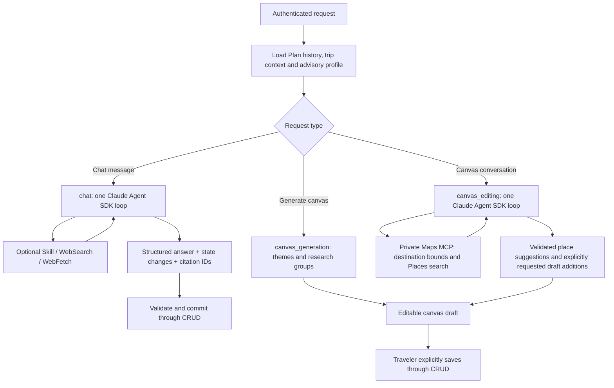

# Current LLM flow

Updated 2026-10-08. This describes the implemented code, superseding older multi-stage research plans.

## Three LangGraph nodes

### Chat

1. The service authorizes the traveler and Plan, acquires the existing context run lease, and loads saved conversation history, the active brief, shared trip context, and advisory profile. The SDK receives the last 12 messages, each bounded to 2,000 characters. Credentials and traveler identity are excluded from the model payload.
2. `ConversationNode` invokes `ClaudeSdkConversationClient.complete_conversation` once. There is no model router, separate research graph node, or second answer-writing query.
3. Inside that SDK invocation, Claude can answer stable questions directly or use the travel-research skill and native web tools. Explicit research requests, changing information and uncertain facts require verification. It can refine searches within the existing limits.
4. Claude returns one structured result: `answer`, `state_changes`, `needs_input`, `evidence_ids`. The stream adapter projects only the answer string from SDK `StructuredOutput` tool argument deltas. JSON, reasoning and tool commentary remain private. If the SDK does not supply answer deltas, the validated final answer is used.
5. Code validates the result, state operations, explicit-intent quotes and observed citations. Only then does the service complete the CRUD context run and emit accepted state. Partial visible text remains provisional; cancellation or failure does not apply proposed edits.

**One SDK invocation is not necessarily one billable model request.** Tool calls and structured-output processing can require multiple internal model turns. All of those turns share the chat's single configured time/cost allowance. Effort remains `low`.

### Canvas

The separate `canvas_generation` node maps essentials, destination map and travel containers directly from state. Its themes worker summarizes conversation/preferences; its research worker assembles findings and useful websites. Each generated group retains its existing generate → review → optional one revision policy. The total canvas ceiling remains 0.35 USD / 120 seconds, further constrained by configuration. Generation produces an editable draft; explicit Save remains required.

Canvas research reads relevant destination resources when existing evidence is
insufficient, even without a specific factual question from the traveler. A
destination research result must contain both a sourced finding and a website;
empty output enters the bounded repair step and becomes a retryable failure if
it remains empty. Failed empty cards display Retry, while completed or edited
content is retained. Themes may legitimately be empty when no preferences exist.

### Canvas editing

`canvas_editing` continues the same persisted Conversation after generation. A
deterministic handoff message explains the available actions. Each editing turn
receives the current **unsaved** canvas snapshot, the last 12 conversation
messages, trip context and advisory traveler profile. Its own prompt and
`canvas-activities` skill focus on discovering suitable activities.

The SDK exposes only its skill, structured output and three Maps tools. Those
tools forward through the private authenticated MCP boundary. Destination
geocoding supplies the default rectangle. If either span is under 5 km (for
example a ski-area name resolving to an office pin), the connector expands it
to include a vicinity rectangle roughly 25 km in each direction. Larger bounds
are preserved. The tool reports `destination_vicinity` so the agent describes
nearby results without claiming administrative boundaries or driving distances.
A traveler can explicitly use the visible map area instead; that rectangle is
never expanded. Google Places search uses an actual geographic
restriction and results are checked against the rectangle again before display.
Search/details calls are capped at three per turn. The existing low effort,
time and cost ceilings apply; there is no extra routing model call.

The model selects observed place IDs and writes short reasons. Provider facts
(names, coordinates, addresses and ratings) come from the tool result registry.
Signed, traveler/Plan-bound suggestions can be returned on the next turn for
requests such as “add the first two”; their provenance expires after one hour.
They are temporary chat cards, not saved options. Conversation text persists;
ephemeral cards are refreshed by searching again after reopening.

The browser renders the approved `ActivitySuggestions` A2UI component from the
allow-listed `STATE_SNAPSHOT.canvas_edit_result` AG-UI projection. Preview leaves
the draft unchanged. Add to plan, or an explicit current-message addition,
creates deduplicated draft pins only after successful completion. Stop/failure
does not apply pending additions. Saving remains the existing confirmed CRUD
canvas action. This first editing flow does not alter research requirements,
traveler memory, bookings or other canvas components.

### State and memory

- CRUD owns saved conversation, resumable trip context, run leases and durable Plans. Agent-generated context edits remain separate from saved Plan requirements.
- AgentCore Runtime transport, authentication, cancellation and profile-memory sync remain in place. Local mode continues to call the local agent service.
- The canonical CRUD traveler profile remains advisory input; the memory adapter may provide a matching mirror. Chat does not write long-term memory.
- Successfully read evidence is shared between chat and canvas in a traveler/Plan-scoped process cache (30-minute expiry, 100 Plans). Read evidence older than 30 days is excluded; the prompt requires refreshing volatile facts. This cache does not survive a service restart and is not a durable retrieval store.
- Cancellation, replay receipts, context locks, source allow-listing, subprocess isolation and cleanup remain non-LLM code.

## Code map

| Responsibility | File |
| --- | --- |
| Graph branch selection | `services/agent/graph/builder.py` |
| Auth, context, persistence, AG-UI stream | `services/agent/service.py` |
| Single SDK chat loop | `services/agent/claude/sdk_conversation.py` |
| Chat instructions | `services/agent/prompts/chat-v1.md` |
| Answer-only streaming projection | `services/agent/claude/chat_stream.py` |
| Shared isolated SDK runtime and observed tools | `services/agent/claude/runtime.py` |
| Canvas assembly | `services/agent/graph/nodes/canvas_generation.py` |
| Canvas editor loop / prompt | `services/agent/claude/canvas_editor.py`, `services/agent/prompts/canvas-editing-v1.md` |
| Maps client / private tools | `services/agent/maps_client.py`, `services/mcps/map_server.py` |
| Editing projection / provenance | `services/agent/editing_contracts.py`, `services/agent/place_tickets.py` |
| State edit validation | `services/trip_context.py` |

Removed: agentic onboarding graph/endpoint, old conversation/research/writer prompts, standalone chat research nodes, unused agent Gateway/local-MCP adapters, legacy candidate-action dispatch and candidate snapshot cache. Current form onboarding, sidebar candidates, independent connector services, memory and canvas remain available. Legacy response fields remain for wire compatibility but are no longer produced by chat.

SDK event contracts: [streaming output](https://code.claude.com/docs/en/agent-sdk/streaming-output), [structured output](https://code.claude.com/docs/en/agent-sdk/structured-outputs).
