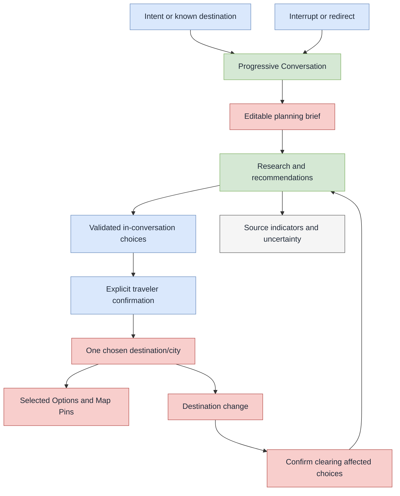

# US-002 — Research and shape a plan through conversation

## User story

As a traveler, I can explore a holiday idea conversationally, answer or skip focused questions, and explicitly confirm the decisions that shape my plan, so I can move from an initial intent to a confident single-destination plan without surrendering control to the agent.

## Success outcome

The traveler can begin with either a known destination or an open-ended intent, such as reliable summer wind for windsurfing or a European city with nightlife and history. Travella progressively researches and narrows the idea, maintains an editable planning brief, and lets the traveler commit to one destination/city and selected options deliberately.

The agent helps with research and recommendations, but it does not silently make plan decisions. A supplier redirect and the completion of a booking are outside this story.

## Confirmed interaction model

- A Draft Plan may begin without a destination while the traveler explores an intent. The MVP supports one final destination or city per plan.
- The Conversation is a light, progressive grilling session, not a long mandatory questionnaire. The agent can begin low-risk research early, asks only questions that materially narrow the search, and lets the traveler fast-forward when they already know an answer.
- The agent may use validated generative-UI components for focused choices, comparisons, workspace composition, and navigation. The exact component schema and catalog remain open.
- A traveler explicitly confirms every plan change, including setting or changing the destination, adding or removing a Selected Option, and any resulting Map Pin change.
- The traveler can send a new message at any time. The agent stops its current thinking immediately, handles the new message, then continues or restarts research from the latest context when appropriate. It never presents an obsolete result.

## Planning brief

Travella maintains a structured, traveler-editable planning brief for the Plan. It consolidates preferences and constraints that arise through the Conversation, such as interests, dates, budget, group, transport tolerance, and accessibility or other requirements.

- The agent updates active brief entries immediately when the traveler supplies or clearly implies them.
- The traveler can manually edit or delete any brief entry.
- The agent asks about one preference or decision at a time. It either researches from the answer or asks the next most useful question; it does not present a batch questionnaire.
- A traveler edit is authoritative until the traveler changes it again. An agent inference that would change an existing traveler entry remains tentative and needs confirmation before replacing it.
- Deleting an entry removes it as an active preference. The underlying fact remains available to the agent only as inactive, previously mentioned context, so it can avoid unnecessarily re-asking the same question.
- Inactive entries must not influence ranking or recommendations unless the traveler explicitly brings them back into the conversation.

## Planning requirements and generated workspace

During initial planning, the agent establishes which core travel categories the traveler expects to need: a return flight, accommodation, and a car rental. This is a small, editable **Planning Requirements** set, separate from a search result or a Selected Option.

- Each core category is `needed`, `not needed`, or `undecided`. The traveler may state a need in free text or choose it in a validated UI control.
- The agent may infer a tentative requirement, but it must obtain traveler confirmation before it changes the saved requirement or composes the initial workspace from it.
- A confirmed requirement composes an editable workspace with the Planning Canvas map as the permanent surface plus the relevant flight, accommodation, and/or car-rental planning surfaces. A surface initially provides its relevant controls and empty state; it does not silently begin a provider search or save a choice.
- The traveler can add a category later from the UI or Conversation, for example, “Add car rental.” That action adds the surface after confirmation and leaves the rest of the Plan intact.
- The traveler can navigate by chat or UI, for example, “Show accommodation” or “Switch to the map.” Navigation changes the active view only; it is not a Plan mutation.
- Removing a surface with no saved item removes the requirement and surface after confirmation. When a surface has a saved Selected Option or related Map Pin, Travella clearly separates hiding the surface from removing the saved item, and requires an explicit confirmation for any saved-item removal.
- The map remains available regardless of the current requirements. Places remain available through the map/place capability rather than being treated as a core travel-category requirement.

## Temporary destination candidates

During destination discovery, the graph keeps a compact, Plan-scoped candidate list. A candidate is one destination/city in the MVP, not a country, route, or multi-city plan.

- A candidate has a stable identifier, a status (`shortlisted`, `being explored`, or `rejected`), a simple confidence label (`strong fit`, `possible fit`, or `weak fit`), a short explanation of fit and caveats, and references to normalized evidence records. Each material fit claim or caveat cites its supporting source or sources. It never stores full raw research content in graph state.
- Only one candidate is `being explored` at a time. A traveler-named destination outside the shortlist becomes that active candidate immediately and offers a clear path to choose it as the Plan destination.
- The first shortlist has at most five candidates. It may be shorter when fewer places fit. `Weak fit` candidates appear only when there are not enough stronger matches.
- The agent does not reveal partial candidate cards while a research pass is running. It shows only concise progress states, then presents the completed shortlist as one result.
- A change to an active Brief entry that affects destination discovery starts a fresh research pass automatically. The agent presents a replacement shortlist only after that pass is complete.
- The traveler may also explicitly refresh recommendations without changing the Brief, for example to request newer research.
- During that refresh, the prior completed shortlist remains visible with a quiet updating state. It is replaced only by the next complete shortlist.
- When the traveler asks for more ideas, the agent extends the list. It keeps existing order stable and does not silently remove earlier candidates; later, stronger matches may be visually de-emphasized only with an explanation.
- A rejected candidate and its rejection reason remain available for this Plan so it is not suggested again. A completely new Plan starts without those rejections.
- Conflicting or thin evidence marks a candidate as needing more research. If no candidate fits, the agent explains the gap and asks one focused question rather than manufacturing a full shortlist.
- Candidate records survive normal Plan checkpoints. After the traveler confirms a destination, other candidates remain saved as quiet fallback context, not visible in the normal destination view. The agent brings them back only if the traveler asks to change/reconsider the destination or a major new constraint makes it unsuitable.

## Destination discovery and change

1. The traveler creates or resumes a Draft Plan and opens its linked Conversation.
2. The traveler begins with an intent or a known destination.
3. The agent performs relevant research, offers focused questions or choices when useful, and updates the planning brief as the traveler responds.
4. The agent establishes and proposes the initial Planning Requirements with one focused question or validated choice at a time.
5. The traveler confirms, changes, or defers those requirements; Travella composes the map plus the relevant empty planning surfaces.
6. The agent shows a shortlist of compact destination candidates, or explores one candidate in more depth when the traveler asks.
7. The traveler explicitly chooses one destination/city for the Plan.
8. If the traveler later chooses a different destination/city, Travella identifies affected destination-specific Selected Options and Map Pins.
9. Travella requires confirmation before clearing those affected choices and pins. It preserves the wider active brief, inactive historical context, and quiet fallback candidates so the agent can offer relevant alternatives for the new destination.

## Research transparency and uncertainty

- Research-backed recommendations display lightweight source/search indicators without disrupting the Conversation.
- The traveler can open the supporting material from those indicators when they want to inspect it.
- A shortlist event carries only compact source badges and evidence identifiers. Supporting material is requested only after the traveler opens a badge; raw source content is never included in the initial shortlist payload.
- Opening a source badge shows a small in-app source panel first, with an optional link to the original source rather than an automatic redirect away from Travella.
- Citations stay visually minimal. Travella does not add source-type or credibility labels in the MVP.
- Research activity is represented by concise, user-facing states: `preparing`, `searching`, `comparing`, `needs your input`, `ready to choose`, and `unable to continue`. These use a small icon or animation, not exposed chain-of-thought or detailed internal reasoning.
- When evidence conflicts, is stale, or is insufficient to support a confident recommendation, the agent says so and asks the traveler how to proceed.
- Travella presents only functional provider-backed search modes. A mode whose provider integration is unavailable remains hidden; demonstration data, if ever shown, must be labeled honestly.
- Full unselected recommendations and source bundles are temporary research output, not durable Plan data. A compact candidate assessment and its evidence references may remain in Plan-scoped checkpoint state for recovery and later reconsideration.

## Happy-path flow

1. An authenticated traveler opens a Draft Plan and its Conversation.
2. The traveler describes an idea, for example: “I am a windsurfer and want a summer holiday with reliable wind at the same time each day.”
3. The agent begins relevant research, shows a concise research state and source indicators, and asks only the next useful question or presents a focused choice.
4. The traveler answers, edits the planning brief, or fast-forwards by stating a decision they have already made.
5. The agent establishes and the traveler confirms, changes, or defers core Planning Requirements. Travella generates the map plus only the relevant empty planning surfaces.
6. The agent updates the active brief and presents up to five compact candidates with accessible supporting material.
7. The traveler can explore one candidate in more depth, reject it, ask for more options, or explicitly choose a destination/city.
8. The traveler can later add a planning surface or navigate to one through chat or UI; adding a surface does not start a search or save an option.
9. The agent continues the Conversation in the context of that destination, but waits for explicit confirmation before changing the Plan with a Selected Option or Map Pin.
10. A new traveler message stops current thinking; the agent handles it and then continues or restarts research using the latest context.

## In scope

- Intent-led and destination-led discovery for one Draft Plan.
- One linked Conversation per Plan.
- Progressive agent questioning, research, recommendations, and explainable uncertainty.
- A structured, traveler-editable planning brief with active and inactive context states.
- Traveler-confirmed Planning Requirements and a generated, editable workspace made of the permanent map plus relevant optional planning surfaces.
- A compact, Plan-scoped candidate list for destination discovery, including shortlist, active exploration, rejection, confidence, and evidence references.
- Explicit confirmation for every plan change.
- Destination commitment and confirmed clearing of destination-specific selections/pins when changing destination.
- In-conversation validated A2UI-style choice and comparison components.
- Source indicators and access to supporting research material.
- Interrupting or redirecting in-progress research.

## Out of scope

- Multi-destination planning, routes, or day/time itinerary assignment.
- Automatic selection, automatic addition to a Plan, or autonomous booking.
- Supplier booking confirmation; a later supplier redirect is only a handoff to an external supplier.
- Persisting unselected research results or source bundles as Plan data.
- The final A2UI schema/component catalog, provider set, database technology, API tree, AWS infrastructure, or frontend wireframes.

## Acceptance criteria

1. A traveler can start a Draft Plan with either a known destination/city or an open-ended travel intent.
2. A Draft Plan can have no destination during discovery and has no more than one chosen destination/city in the MVP.
3. The agent can start relevant low-risk research before collecting every preference and asks focused questions only as useful.
4. The agent asks only one preference or decision question at a time; the traveler can supply an early decision, skip a question, interrupt research, or redirect the Conversation without losing control of the Plan.
5. The active planning brief reflects new traveler preferences immediately and can be manually edited by the traveler.
6. A manual brief edit takes precedence over agent inference; an inferred conflicting change remains tentative until confirmed.
7. Deleted brief entries are retained only as inactive, previously mentioned context and do not influence recommendations unless the traveler reintroduces them.
8. The first destination shortlist contains no more than five candidates, may contain fewer, and shows weak-fit candidates only if insufficient stronger matches exist.
9. Candidates store compact assessment and evidence references, not raw research payloads. Rejected candidates remain available only for the current Plan; a new Plan starts fresh.
10. A traveler can explore one candidate at a time, reject it, ask to extend the shortlist, or name a new destination directly.
11. Confirming a destination hides, but retains, alternative candidates as Plan-scoped fallback context for a later reconsideration.
12. A new message stops ongoing reasoning, and no obsolete research result is shown after the agent continues or restarts from the latest context.
13. Research shows concise progress states without exposing internal reasoning.
14. Candidate cards appear only once the research pass has produced a completed shortlist; partial cards are not shown.
15. A change to an active Brief entry that affects destination discovery automatically starts a fresh research pass; the replacement shortlist appears only when it is complete.
16. The traveler can manually refresh recommendations without changing the Brief.
17. The prior completed shortlist remains visible with a quiet updating state until a replacement shortlist is complete.
18. No destination, Selected Option, Map Pin, or other Plan change is made without the traveler’s explicit confirmation.
19. Changing the chosen destination identifies affected destination-specific selections and pins and requires confirmation before clearing them.
20. Research-backed recommendations expose lightweight source/search indicators and let the traveler inspect the supporting material on demand; initial shortlist payloads do not contain raw source material.
21. A source badge opens a small in-app source panel before any optional external redirect.
22. The agent explicitly communicates conflicting, stale, or insufficient evidence and asks the traveler how to proceed.
23. Full unselected research payloads and source bundles are not persisted as Plan data; compact candidate assessments and evidence references may persist in Plan-scoped checkpoint state.
24. Provider-dependent modes are hidden until backed by a functional integration, and any demonstration data is labeled honestly.
25. Every material candidate fit claim and caveat has a compact source citation. Opening it loads the in-app source panel on demand rather than including raw source material in the shortlist.
26. After refresh or reconnect, Travella restores the latest consistent snapshot directly. It shows the last completed shortlist when present and does not automatically restart interrupted research.
27. A Brief-driven or manual refresh keeps the prior completed shortlist visible with a quiet updating state until one complete replacement shortlist is available.
28. The traveler can confirm, change, or defer whether a flight, accommodation, and car rental are needed during initial planning.
29. Confirmed Planning Requirements generate the map plus only the relevant empty planning surfaces; they do not start a provider search or create a Selected Option, Map Pin, or Supplier Redirect.
30. The traveler can add a planning surface later from the UI or Conversation without restarting the Plan, and can navigate to an existing surface without changing saved Plan data.
31. Removing a surface with a saved item distinguishes hiding the surface from removing the saved Selected Option or Map Pin, and never removes saved data without explicit confirmation.

## Decisions

| Area | Decision | Rationale |
| --- | --- | --- |
| Starting point | A Draft Plan may begin with an intent and no destination. | The product must support genuine destination discovery, not only planning after a city is known. |
| MVP destination boundary | Each Plan ends with one final destination/city. | Keeps the first canvas and planning model focused. |
| Conversation approach | The agent uses a light, progressive grilling conversation; the traveler may fast-forward or revise. | It gathers useful detail without making planning feel like a mandatory form. |
| Choice UI | The agent can present validated A2UI-style choices and comparisons in the Conversation. | Focused micro-decisions make an agentic flow more dynamic while keeping the interface safe. |
| Generative workspace | Confirmed Planning Requirements compose the permanent map plus only the relevant flight, accommodation, and car-rental surfaces. | GenUI creates a useful, tailored workspace without treating it as unbounded agent-generated application code. |
| Requirement authority | The agent may propose needs, but the traveler confirms any saved requirement; a requirement opens an empty planning surface rather than starting a search or selecting an option. | The traveler controls both the scope of the workspace and consequential provider activity. |
| Workspace evolution | The traveler can add, remove, or navigate to surfaces later through chat or UI; removal of saved data is always distinct and confirmed. | The workspace can grow with the trip without silently discarding planning decisions. |
| Authority | Every Plan change requires explicit traveler confirmation. | The traveler retains control of consequential travel decisions. |
| Brief updates | The agent immediately records clearly stated or implied active preferences in the editable brief. | The brief stays useful without duplicate data entry. |
| Brief authority | Traveler edits take precedence. An agent inference that conflicts with one remains tentative until confirmed. | The agent cannot silently rewrite a decision the traveler made directly. |
| Question cadence | The agent explores one preference or decision at a time. | The experience stays conversational and avoids a brittle multi-question form. |
| Brief deletion | Deleted entries become inactive historical context and cannot influence recommendations unless reintroduced. | Preserves conversational continuity without treating removed information as a current preference. |
| Candidate shape | A candidate is a compact, single-destination assessment with status, confidence, fit/caveats, and evidence references. | It supports clear comparison and recovery without retaining raw research content. |
| Candidate citations | Each material fit claim and caveat cites its supporting source or sources. | The traveler can inspect why a recommendation was made. |
| Candidate shortlist | Show at most five initial candidates; extend only on request; preserve the existing order and options. | The traveler sees a manageable set without losing prior exploration. |
| Candidate reveal | Do not show partial candidate cards; reveal a completed shortlist after the research pass. | Prevents early, incomplete results from feeling like the recommendation. |
| Brief-driven refresh | A destination-discovery-relevant active-Brief change starts a fresh research pass automatically. | Recommendations remain aligned with the traveler’s latest direction. |
| Manual refresh | The traveler can request newer research without changing the Brief. | The traveler can revisit time-sensitive information on demand. |
| Candidate quality | Use strong/possible/weak fit; show weak fit only if needed, and flag thin/conflicting evidence for more research. | Recommendations remain honest instead of filling a quota. |
| Candidate retention | Keep candidate assessments and rejections in the current Plan’s checkpoint state; keep alternatives quiet after destination confirmation; start a new Plan fresh. | The traveler can reconsider without turning exploratory research into permanent cross-Plan preference. |
| Destination change | Clearing destination-specific selections and pins requires confirmation; broader context remains available. | Prevents silent data loss while allowing recommendations to adapt to a new direction. |
| Research provenance | Recommendations show unobtrusive source/search indicators with optional supporting material. | The traveler can inspect evidence without interrupting the conversational flow. |
| Source delivery | A shortlist carries only source badges and evidence identifiers; details load only after a traveler opens one. | Keeps the normal agent event compact and avoids exposing raw research material unnecessarily. |
| Source inspection | Open a small in-app source panel before offering the original external link. | Lets the traveler assess evidence without losing their planning context. |
| Citation presentation | Keep citations visually minimal; do not add source-type or credibility labels. | Evidence remains available without crowding the research experience. |
| Uncertainty | The agent must surface conflicting, stale, or insufficient evidence and ask how to proceed. | Trust requires visible uncertainty rather than false confidence. |
| Research retention | Full unselected research results and source bundles are temporary; compact candidate assessments can be Plan-scoped checkpoint context. | Allows recovery and reconsideration without quietly retaining raw exploratory material. |
| Research control | A new message stops current thinking. The agent resumes or restarts research from the latest context without showing stale output. | The Conversation stays responsive and coherent. |
| Research visibility | Show named, concise research states rather than internal reasoning. | The traveler sees meaningful progress without exposing implementation detail. |

## Technical direction

### Agent flow and model access

- The agent service will use one end-to-end LangGraph flow for a Plan. The flow will grow incrementally from named, inspectable steps with explicit input/output state contracts; it is not a hierarchy of autonomous sub-agents.
- Each step calls a provider-neutral model adapter. Claude is a candidate model provider, but model selection remains configurable without changing the graph's state contracts or tool boundaries.
- The research part of the flow always has web-search access. Tool permissions for other graph steps remain open until those steps are designed.
- Research tools normalize their output into a common evidence record before model synthesis. Evidence records carry the relevant provider/source, URL, retrieval time, concise excerpt, and structured travel facts.
- Retrieved webpages, provider results, and other external content are untrusted data. They cannot issue instructions, invoke tools, or change a Plan without explicit agent interpretation and traveler confirmation.
- Research retries are bounded. When a web or provider request still fails, the agent explains the limitation and offers a next step; it neither retries indefinitely nor fabricates substitute data.

### Plan-scoped state and checkpoints

- Each Plan maps to one isolated LangGraph thread/checkpoint namespace, scoped by the authenticated traveler and Plan identifier. The agent may read only that Plan, its linked Conversation, and its own checkpoint state.
- The MVP allows one active agent session per Plan. A second session first reconciles a checkpoint, then makes the original session read-only before taking over.
- The graph keeps one coherent context. Every field declares whether it is internal-only, checkpointed, exposed through AG-UI, or an allowed combination of those roles.
- AG-UI receives only an explicitly whitelisted, validated projection of graph context. It never receives a full checkpoint, internal reasoning, credentials, or raw provider/web payloads.
- A completed destination shortlist reaches the browser through one validated `shortlist_ready` event containing the compact candidate-card projection. The browser never constructs a shortlist from incremental candidate-card events.
- The canvas can receive live agent context through AG-UI. Traveler actions appear immediately; agent-originated micro-updates are briefly batched into composed, smooth UI updates.
- Checkpoints retain normalized context needed to resume work, including compact candidate assessments and rejection reasons, but never raw provider payloads or full source bundles. Every checkpoint carries a state-schema version and uses explicit migrations as the graph evolves.
- Checkpoints are created at major journey milestones, after confirmed Plan changes, and after a short idle period. Returning to a Plan restores the latest successful checkpoint. If a completed shortlist exists, Travella shows it; unfinished research is shown as interrupted and is not restarted automatically.
- A checkpoint is not considered saved until its LangGraph state and matching CRUD snapshot are consistent. Partial saves are retried safely and are never presented to the traveler as saved progress.
- On a browser refresh or reconnect, Travella restores the latest consistent Plan and agent-state snapshot directly; it does not replay historical chat or UI events to reconstruct the current screen.
- Recently opened Plan contexts may be held in a small, transient server-side cache to avoid unnecessary durable-store reads. The cache is authenticated and Plan-scoped, may be discarded at any time, and is never the source of truth.
- Checkpoint state follows the Draft Plan deletion and seven-day recovery lifecycle. It becomes unavailable during deletion, can be restored with the Plan during recovery, and is permanently purged with the Plan afterward.
- The graph depends on an agent-state storage interface for checkpoint save/load, recovery-period purge, and active-session takeover. The backing NoSQL technology remains undecided.

### Initial state and event contract

This is the initial contract for the destination-discovery part of the graph. It is deliberately a design contract, not a database schema or final AG-UI component schema.

| Area | Kept in graph/checkpoint context | Durable Plan data | May be exposed to the browser |
| --- | --- | --- | --- |
| Identity and ordering | Server-verified traveler ID, Plan ID, active-session ID, event ID, state version | Plan and Conversation ownership | Never directly |
| Planning brief | Active, tentative, and inactive entries; origin and last-confirmed/changed time | Traveler-approved editable Brief | Whitelisted Brief projection only |
| Planning Requirements | Tentative agent interpretation and current composition proposal | Traveler-confirmed `needed`, `not needed`, or `undecided` state for flight, accommodation, and car rental | Validated requirement choices, workspace surface list, and active-surface navigation only |
| Destination candidates | Compact candidate records, status, confidence, fit/caveats, evidence references, and rejection reasons | Not Selected Options or Map Pins | Completed shortlist and deliberate candidate-action results only |
| Chosen destination | Current proposed or confirmed destination and affected-change analysis | Confirmed destination after traveler confirmation | Whitelisted destination state and confirmation UI |
| Research run | Current visible status, working focus, normalized evidence references, and cancellation/restart information | No raw research payloads | Concise research-status projection only |
| UI delivery | Validated event revision and explicit exposed-field projection | None | Only whitelisted, schema-validated AG-UI events, including workspace composition and navigation projections |

- The server verifies `travelerId`, `planId`, `sessionId`, and `eventId`; the browser does not author them.
- All browser actions are normalized into typed events. The initial set is `chat_message`, `canvas_brief_patch`, `planning_requirements_patch`, `workspace_action`, `candidate_action`, `confirmation`, `resume`, and `takeover`.
- `planning_requirements_patch` proposes or confirms a core travel requirement. `workspace_action` requests an allowed surface add, hide, remove, or navigation target; it cannot itself remove a Selected Option or Map Pin.
- `candidate_action` covers exploring a candidate, rejecting one, asking for more options, naming a new destination, and opening a cited source. These are context actions, not Plan mutations.
- Every event is idempotent by its event ID. Re-delivery cannot trigger duplicate research, duplicate checkpoint work, or a repeated Plan mutation.
- The only initial completed-list event is `shortlist_ready`. It carries a complete, compact shortlist; source detail is retrieved on demand after a traveler action.
- A current research run has a visible state (`preparing`, `searching`, `comparing`, `needs your input`, `ready to choose`, or `unable to continue`). A new traveler message stops current thinking. The agent then continues or restarts from the latest context, never emitting the obsolete run's result.
- On recovery, the agent shows the last completed shortlist when one exists. It does not automatically restart an interrupted research run.

### Long-term memory

- Amazon Bedrock AgentCore Memory is the intended MVP long-term-memory capability behind the agent-memory interface.
- AgentCore may automatically extract useful long-term insights from Conversations. Long-term memory is scoped to the authenticated traveler, not a single Plan, and can support future Plans without crossing travelers.
- Long-term memories remain after the source Draft Plan and Conversation are deleted. They are advisory context only: current Plan preferences, the current Conversation, and the traveler's latest instruction always take precedence.
- The graph retrieves only relevant long-term memories at Plan entry and when the topic materially changes. Retrieved memories enter the graph as bounded structured data, never as raw instructions.
- Long-term-memory controls are not part of the MVP user interface.

### Authorization, mutations, and operations

- Any Plan mutation requires a short-lived, single-use confirmation token created by the traveler's UI action. The CRUD API verifies that it is bound to the exact traveler, Plan, and proposed change; an agent request alone cannot mutate a Plan.
- Checkpoint state and long-term memory are encrypted at rest. Every read/write is authorized server-side against the authenticated traveler and, where applicable, the current Plan scope.
- Production observability records privacy-preserving operational metadata such as trace IDs, node/tool timing, outcomes, and error classes. It excludes or redacts Conversation content, raw research payloads, credentials, and personal data by default.

### Technical decisions still open

- Whether, how, and when prose responses stream through AG-UI.
- The exact LangGraph nodes, their full state contracts, and non-research tool permissions.
- Model/provider selection and model-routing policy.
- AgentCore configuration details and long-term-memory retrieval policy.
- The checkpoint backing store, exact idle duration, and checkpoint retry/reconciliation mechanics.

## Decision relationships

## Related artifacts

- [Agentic plan flow](agentic-plan-flow.drawio)
- [Agentic plan flow preview](agentic-plan-flow-preview.svg)
- [LangGraph flow](langgraph-flow.drawio)
- [LangGraph flow preview](langgraph-flow-preview.svg)
- [Domain glossary](../../../CONTEXT.md)
- [Travella overview](../../overview.md)
- [Architecture foundations](../../planning/architecture-foundations.md)
- [Service-boundary ADR](../../adr/0001-separate-agent-data-and-connector-services.md)
- [US-001 — Access a private Travella account](../login/README.md)

## Open implementation decisions

- Final validated generative-UI schema and approved component catalog, including workspace-composition, tool-result, and navigation components.
- Exact interaction design for the planning brief, research indicators, and confirmation controls.
- Provider set, provider access, source types, and freshness rules.
- Data model and retention mechanics for active/inactive brief context and interrupted work.
- API/event contracts across the frontend, agent service, CRUD backend, and connector service.
- AWS compute, networking, database, observability, and deployment choices.
