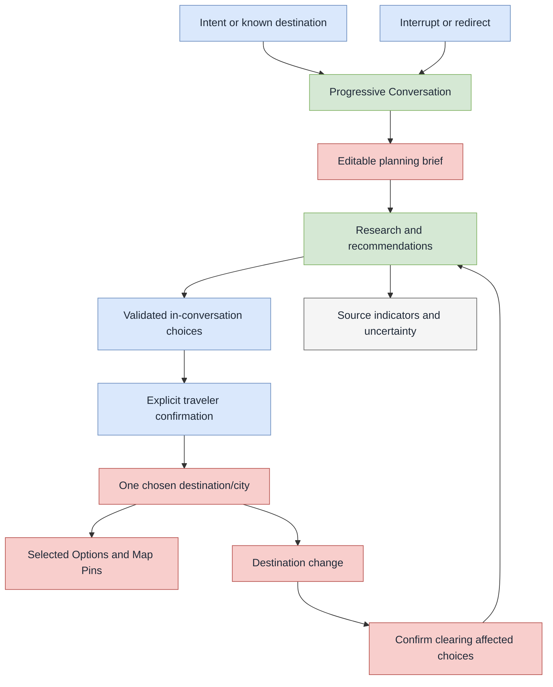

# US-002 — Research and shape a plan through conversation

## User story

As a traveler, I can explore a holiday idea conversationally, answer or skip focused questions, and explicitly confirm the decisions that shape my plan, so I can move from an initial intent to a confident single-destination plan without surrendering control to the agent.

## Success outcome

The traveler can begin with either a known destination or an open-ended intent, such as reliable summer wind for windsurfing or a European city with nightlife and history. Travella progressively researches and narrows the idea, maintains an editable planning brief, and lets the traveler commit to one destination/city and selected options deliberately.

The agent helps with research and recommendations, but it does not silently make plan decisions. A supplier redirect and the completion of a booking are outside this story.

## Confirmed interaction model

- A Draft Plan may begin without a destination while the traveler explores an intent. The MVP supports one final destination or city per plan.
- The Conversation is a light, progressive grilling session, not a long mandatory questionnaire. The agent can begin low-risk research early, asks only questions that materially narrow the search, and lets the traveler fast-forward when they already know an answer.
- The agent may use validated, in-conversation A2UI-style components for focused choices and comparisons. The exact component schema and catalog remain open.
- A traveler explicitly confirms every plan change, including setting or changing the destination, adding or removing a Selected Option, and any resulting Map Pin change.
- The traveler can interrupt or redirect in-progress research at any time. The agent cancels or deprioritizes the superseded work and follows the newer direction.

## Planning brief

Travella maintains a structured, traveler-editable planning brief for the Plan. It consolidates preferences and constraints that arise through the Conversation, such as interests, dates, budget, group, transport tolerance, and accessibility or other requirements.

- The agent updates active brief entries immediately when the traveler supplies or clearly implies them.
- The traveler can manually edit or delete any brief entry.
- Deleting an entry removes it as an active preference. The underlying fact remains available to the agent only as inactive, previously mentioned context, so it can avoid unnecessarily re-asking the same question.
- Inactive entries must not influence ranking or recommendations unless the traveler explicitly brings them back into the conversation.

## Destination discovery and change

1. The traveler creates or resumes a Draft Plan and opens its linked Conversation.
2. The traveler begins with an intent or a known destination.
3. The agent performs relevant research, offers focused questions or choices when useful, and updates the planning brief as the traveler responds.
4. The traveler explicitly chooses one destination/city for the Plan.
5. If the traveler later chooses a different destination/city, Travella identifies affected destination-specific Selected Options and Map Pins.
6. Travella requires confirmation before clearing those affected choices and pins. It preserves the wider active brief and inactive historical context so the agent can offer relevant alternatives for the new destination.

## Research transparency and uncertainty

- Research-backed recommendations display lightweight source/search indicators without disrupting the Conversation.
- The traveler can open the supporting material from those indicators when they want to inspect it.
- When evidence conflicts, is stale, or is insufficient to support a confident recommendation, the agent says so and asks the traveler how to proceed.
- Travella presents only functional provider-backed search modes. A mode whose provider integration is unavailable remains hidden; demonstration data, if ever shown, must be labeled honestly.
- Unselected recommendations and their source bundles are temporary research output. They are not durable plan data.

## Happy-path flow

1. An authenticated traveler opens a Draft Plan and its Conversation.
2. The traveler describes an idea, for example: “I am a windsurfer and want a summer holiday with reliable wind at the same time each day.”
3. The agent begins relevant research, shows its progress/source indicators, and asks only the next useful question or presents a focused choice.
4. The traveler answers, edits the planning brief, or fast-forwards by stating a decision they have already made.
5. The agent updates the active brief and explains recommendations with accessible supporting material.
6. The traveler explicitly chooses a destination/city.
7. The agent continues the Conversation in the context of that destination, but waits for explicit confirmation before changing the Plan with a Selected Option or Map Pin.
8. The traveler may interrupt or redirect research at any time; the agent follows the newest instruction.

## In scope

- Intent-led and destination-led discovery for one Draft Plan.
- One linked Conversation per Plan.
- Progressive agent questioning, research, recommendations, and explainable uncertainty.
- A structured, traveler-editable planning brief with active and inactive context states.
- Explicit confirmation for every plan change.
- Destination commitment and confirmed clearing of destination-specific selections/pins when changing destination.
- In-conversation validated A2UI-style choice and comparison components.
- Source indicators and access to supporting research material.
- Interrupting or redirecting in-progress research.

## Out of scope

- Multi-destination planning, routes, or day/time itinerary assignment.
- Automatic selection, automatic addition to a Plan, or autonomous booking.
- Supplier booking confirmation; a later supplier redirect is only a handoff to an external supplier.
- Persisting unselected research results or source bundles as Plan data.
- The final A2UI schema/component catalog, provider set, database technology, API tree, AWS infrastructure, or frontend wireframes.

## Acceptance criteria

1. A traveler can start a Draft Plan with either a known destination/city or an open-ended travel intent.
2. A Draft Plan can have no destination during discovery and has no more than one chosen destination/city in the MVP.
3. The agent can start relevant low-risk research before collecting every preference and asks focused questions only as useful.
4. The traveler can supply an early decision, skip a question, interrupt research, or redirect the Conversation without losing control of the Plan.
5. The active planning brief reflects new traveler preferences immediately and can be manually edited by the traveler.
6. Deleted brief entries are retained only as inactive, previously mentioned context and do not influence recommendations unless the traveler reintroduces them.
7. No destination, Selected Option, Map Pin, or other Plan change is made without the traveler’s explicit confirmation.
8. Changing the chosen destination identifies affected destination-specific selections and pins and requires confirmation before clearing them.
9. Research-backed recommendations expose lightweight source/search indicators and let the traveler inspect the supporting material.
10. The agent explicitly communicates conflicting, stale, or insufficient evidence and asks the traveler how to proceed.
11. Unselected recommendations and their source bundles are not persisted as Plan data.
12. Provider-dependent modes are hidden until backed by a functional integration, and any demonstration data is labeled honestly.

## Decisions

| Area | Decision | Rationale |
| --- | --- | --- |
| Starting point | A Draft Plan may begin with an intent and no destination. | The product must support genuine destination discovery, not only planning after a city is known. |
| MVP destination boundary | Each Plan ends with one final destination/city. | Keeps the first canvas and planning model focused. |
| Conversation approach | The agent uses a light, progressive grilling conversation; the traveler may fast-forward or revise. | It gathers useful detail without making planning feel like a mandatory form. |
| Choice UI | The agent can present validated A2UI-style choices and comparisons in the Conversation. | Focused micro-decisions make an agentic flow more dynamic while keeping the interface safe. |
| Authority | Every Plan change requires explicit traveler confirmation. | The traveler retains control of consequential travel decisions. |
| Brief updates | The agent immediately records clearly stated or implied active preferences in the editable brief. | The brief stays useful without duplicate data entry. |
| Brief deletion | Deleted entries become inactive historical context and cannot influence recommendations unless reintroduced. | Preserves conversational continuity without treating removed information as a current preference. |
| Destination change | Clearing destination-specific selections and pins requires confirmation; broader context remains available. | Prevents silent data loss while allowing recommendations to adapt to a new direction. |
| Research provenance | Recommendations show unobtrusive source/search indicators with optional supporting material. | The traveler can inspect evidence without interrupting the conversational flow. |
| Uncertainty | The agent must surface conflicting, stale, or insufficient evidence and ask how to proceed. | Trust requires visible uncertainty rather than false confidence. |
| Research retention | Unselected recommendations and source bundles are temporary. | Avoids quietly retaining exploratory material as durable traveler data. |
| Research control | The traveler can interrupt or redirect research at any time. | The Conversation remains responsive to the traveler’s latest intent. |

## Decision relationships

## Related artifacts

- [Agentic plan flow](agentic-plan-flow.drawio)
- [Agentic plan flow preview](agentic-plan-flow-preview.svg)
- [Domain glossary](../../../CONTEXT.md)
- [Travella overview](../../overview.md)
- [Architecture foundations](../../planning/architecture-foundations.md)
- [Service-boundary ADR](../../adr/0001-separate-agent-data-and-connector-services.md)
- [US-001 — Access a private Travella account](../login/README.md)

## Open implementation decisions

- Final validated generative-UI schema and approved component catalog.
- Exact interaction design for the planning brief, research indicators, and confirmation controls.
- Provider set, provider access, source types, and freshness rules.
- Data model and retention mechanics for active/inactive brief context and interrupted work.
- API/event contracts across the frontend, agent service, CRUD backend, and connector service.
- AWS compute, networking, database, observability, and deployment choices.
