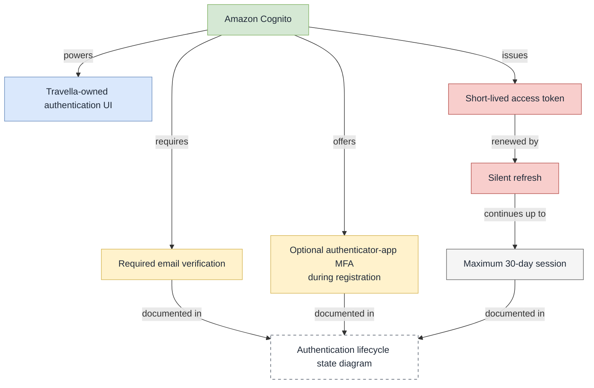

# US-001 — Access a private Travella account

## User story

As a traveler, I can use Travella’s branded account screens to create an account or sign in, so I can securely access only my own saved plans, conversations, and selected travel options.

## User flow

1. The traveler opens Travella’s registration or sign-in screen.
2. A new traveler registers with first name, last name, email, and password; an existing traveler signs in with email and password.
3. Amazon Cognito verifies the new traveler’s email.
4. During registration, the traveler can opt into authenticator-app two-step verification; it is required at future sign-ins only when configured.
5. Cognito issues a short-lived access token. Travella silently refreshes the session for up to 30 days from the last full sign-in.
6. Travella opens **My plans**.

## In scope

- Travella-owned registration and sign-in screens backed by Amazon Cognito.
- Registration with first name, last name, email, and password.
- Required email verification.
- Optional authenticator-app two-step verification, selected during registration.
- Short-lived access tokens with silent refresh for up to 30 days from full sign-in.
- Access only to the traveler’s own plans, conversations, and selected options.

## Out of scope for this story

- Password recovery.
- Profile editing.
- Social sign-in.
- Phone-number collection.

## Design decisions

| Area | Decision | Rationale |
| --- | --- | --- |
| Identity provider | Amazon Cognito | Managed authentication keeps passwords and MFA codes outside Travella services. |
| Authentication UI | Travella-owned registration and sign-in screens | The product needs a distinctive, branded experience. |
| Email verification | Required for every new account | Confirms ownership of the email used to access private travel data. |
| Multi-factor authentication | Optional authenticator-app MFA, chosen during registration | Adds account protection without requiring an extra step for every traveler. |
| Access session | Short-lived access tokens, refreshed silently for up to 30 days from full sign-in | Keeps routine planning uninterrupted while requiring periodic re-authentication. |
| Lifecycle model | [Authentication lifecycle state diagram](auth-lifecycle-state.drawio) | Makes registration, verification, MFA, refresh, expiry, and sign-out transitions explicit. |

## Decision relationships

## Diagrams

Open [login-use-case.drawio](login-use-case.drawio) in Draw.io / diagrams.net to edit the use-case diagram.

Open [login-api-sequence.drawio](login-api-sequence.drawio) in Draw.io / diagrams.net to edit the API sequence diagram. It models Travella’s custom browser UI authenticating directly with Amazon Cognito before calling the protected Travella API.

Open [auth-lifecycle-state.drawio](auth-lifecycle-state.drawio) in Draw.io / diagrams.net to edit the authentication lifecycle state diagram.
